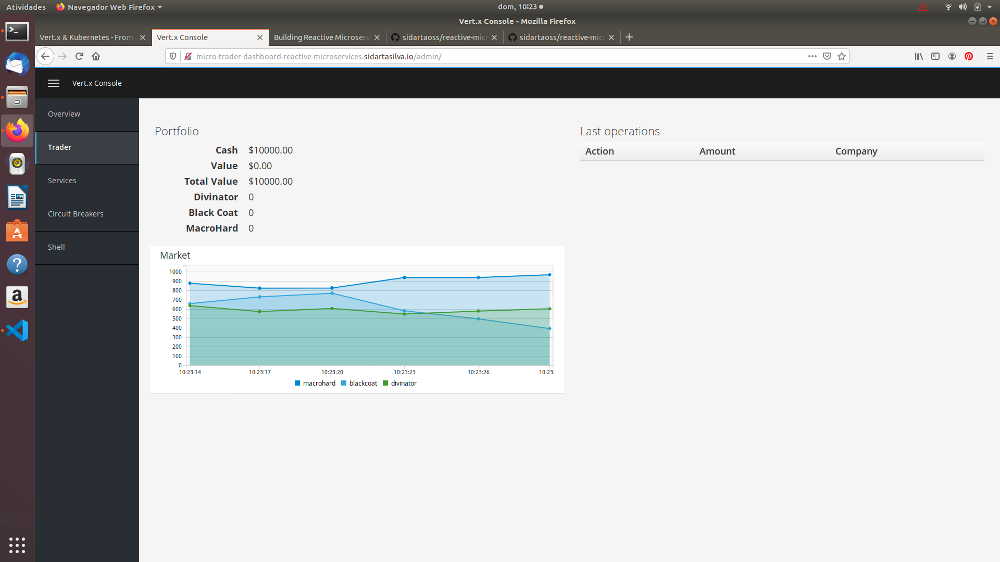
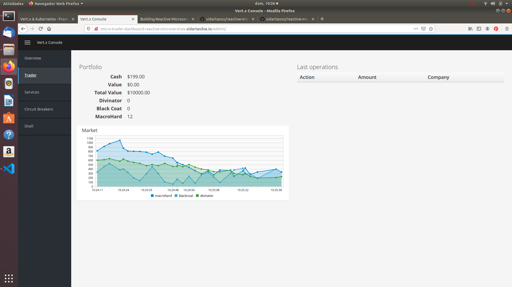

# Building Reactive Microservice Systems

This project is based mainly on the references below.

    <http://escoffier.me/vertx-kubernetes/>

    <https://github.com/yunyu/vertx-console>
    
    ESCOFFIER, C. Building Reactive Microservices in Java Asynchronous and Event-Based Application Design. First Edition. California: O’Reilly Media, Inc., 2017.

    RedHat Developer, accessed 1 November 2019, <https://developers.redhat.com/promotions/building-reactive-microservices-in-java>

    Kubernetes Hands-On - Deploy Microservices to the AWS Cloud 2018, Udemy, accessed 1 November 2019, <https://www.udemy.com/course/kubernetes-microservices>

    <https://github.com/hazelcast/hazelcast-code-samples/>

    <https://vertx.io/docs/vertx-hazelcast>

## The Micro-Trader Application

## Compulsive traders

The compulsive traders project contains several implementations of (very dumb) traders that sell and buy shares. They receive quotes from the event bus and use the portfolio service to buy and sell shared.

Let's rewind a bit to have a better view of the current status.

In the quote-generator we have built a verticle sending market data to the event bus.

In the portfolio service, we expose an event bus service to manager our portfolio.

Traders are the missing link between both. It implements the logic deciding when to buy and sell stocks.

In this project we are going to develop 2 traders:

    * The first trader is developed with the raw Vert.x API (callbacks)

    * The second trader is developed with RX Java 2 (reactive programming)

It gives you an overview of the different programming style proposed by Vert.x, and let you decide which one you prefer. 

### Compulsive and dumb traders

Before seeing how these are implemented, let's explain the absolutelly illogic algorithm used by these traders:

    1. A compulsive trader is choosing one company name and a number of shares.

    2. Randomly, it tries to buy or sell x shares of the company

    It does not check whether or not it has enough shares or money, it just tries... This logic is implemented in TraderUtils.

### Task - The callback-based trader

Let's start with the callback trader. The trader is developed using the raw Vert.x API and so callbacks.

But wait... who wants to write callback-hell code? To ease the readability of the code, we are going to use Vert.x Future.

A Future is a structure encapsulating a deferred result (or failure). Unlike regular Java Future, Vert.x Futures are non-blocking (no get and join methods). You need to listen for the Future completion by attaching a Handler indicating the result (success or failure). Future provides a nice and simple way to structure your code, but that's not all. It also provides high-level operators such as CompositeFuture.all indicating the completion of a set of Futures.

Future objects are created using Future.future(). To be notified of the completion, you need to attach a Handler<AsyncResult> using the Future.setHandler method.

The trader needs the Portfolio service and the market service (the message source sending the market data). We cannot start the trading logic before having retrieved both of them. Use a CompositeFuture to be notified when both are completed (or one fails). A CompositeFuture is a Future, so attach a handler to it that call the initialize method.

    @Override
    public void start(Future<Void> done) throws Exception {

        String company = TraderUtils.pickACompany();

        int numberOfShares = TraderUtils.pickANumber();

        System.out.println("Java-Callback compulsive trader for company " + company + " and shares: " + numberOfShares);

        // TODO Complete the code to apply the trading logic on each message received from the "market-data" message

        // ---

        // Retrieve service discovery
        Future<ServiceDicovery> retrieveServiceDiscovery = getServiceDiscovery(vertx);
        
        // When the service discovery is retrieved, retrieve the portfolio service and market data
        retrieveServiceHandler.setHandler(discovery -> {

            // TODO 1 - Get the Future objects for the portfolio and market services. Just use the methods given below

            Future<PortfolioService> retrieveThePortfolioService = getPortfolioService(discovery.result());
            Future<MessageConsumer<JsonObject>> retrieveTheMarket = getMarketSource(discovery.result());

            // TODO 2 - Use CompositeFuture.all to "wait" until both future are completed

            // TODO 3 - Attach a handler on the composite future, and call initialize

            Future<PortfolioService> retrieveThePortfolioService = getPortfolioService(discovery.result());
            Future<MessageConsumer<JsonObject>> retrieveTheMarket = getMarketSource(discovery.result());

            CompositeFuture.all(retrieveServiceDiscovery, retrieveTheMarket)
                .setHandler(ar -> {
                    initialize(done, 
                            company, 
                            numberOfShares, 
                            retrieveThePortfolioService, 
                            retrieveTheMarket, 
                            ar);
                });

        });

    }

### Task - The RX Java 2 trader

In this task, we re-implement the very same logic but using a different programming style. We are going to use RX Java 2.

Let's use the zip operator to combine the two Singles. When both are completed, attach the message handler to the MessageConsumer and execute the trading logic on each received event. Don't forget the subscription parts.

            @Override
            public void start(Future<Void> future) {

                String company = TraderUtils.pickACompany();

                int numberOfShares = TraderUtils.pickANumber();

                System.out.println("Java-RX compulsive trader configured for company " + company + " and shares: " + numberOfShares);

                ServiceDiscovery.create(vertx, discovery -> {

                    Single<PortfolioService> retrieveThePortfolioService = RXEventBusService.rxGetProxy(discovery, 
                        PortfolioService.class, 
                        record -> record.getName().equalsIgnoreCase("portfolio"));

                    Single<MessageConsumer<JsonObject>> retrieveTheMarket = MessageSource.rxGetConsumer(discovery, 
                        record -> record.getName().equalsIgnoreCase("market-data"));

                    // TODO 1 - "Wait" for both single to be completed (using Single.zip or Single.zipWith methods)
                    retrieveThePortfolioService.zipWith(retrieveTheMarket, (ps, consumer) -> {

                        // TODO 2 - When both single have completed, attach the handler to the message consumer to
                        // execute the trading logic
                        consumer.handler(message -> 

                            // TODO 3 - Use the TradingUtils.dumbTradingLogic method returning a Completable. 
                            // Don't forget to subscribe to it, or nothing will happen. Return 'true' to comply 
                            // with the "zip" operator signature.

                            TraderUtils.dumbTradingLogic(
                                company, 
                                numberOfShares,
                                ps,
                                message.body()
                            )
                            .subscribe());
                            // We need to return something as requested by the "zip" signature.
                        return true;
                    })

                    // TODO 4 - Transform the output into a Completable (toCompletable) and subscribe to it
                    // using: .subscribe(CompletableHelper.toObserver(future)) - it reports the failure or success
                    // to the `done` future.
                        .toCompletable()
                        .subscribe(CompletableHelper.toObserver(future));
                    });

            }

So that we go back to the dashboard and may start seeing some moves on the portfolio, we need to implement the methods buy() and sell() from PortfolioServiceImpl as well.

            @Override
                public void sell(int amount, JsonObject quote, Handler<AsyncResult<Portfolio>> resultHandler) {
                    if (amount <= 0) {
                        resultHandler.handle(Future.failedFuture("Cannot sell" + quote.getString(name) + " - the amount must be greater than 0"));
                        return;
                    }

                    double price = amount * quote.getDouble("bid");

                    String name = quote.getString("name");

                    int current = portfolio.getAmount("name");

                    // 1) Do we have enough stocks?
                    if (current >= amount) {
                        
                        // Yes, sell it
                        int newAmount = current - amount;
                        if (newAmount == 0) {
                            portfolio.getShares().remove(name);
                        } else {
                            portfolio.getShares().put(name, newAmount);
                        }
                        portfolio.setCash(portfolio.getCash() + price);
                        sendActionOnTheEventBus("SELL", amount, quote, newAmount);
                        resultHandler.handle(Future.succeededFuture(portfolio));
                    
                    } else {

                        resultHandler.handle(Future.failedFuture("Cannot sell " + amount + " of " + name + " - not enough stocks in portfolio"))

                    } 

                }

                @Override
                public void buy(int amount, JsonObject quote, Handler<AsyncResult<Portfolio>> resultHandler) {
                    
                    if (amount <= 0) {
                        resultHandler.handle(Future.failedFuture(
                            "Cannot buy "   + quote.getString("name") 
                                            + " - the amount must be greater than 0"));
                        return;
                    }

                    if (quote.getInteger("shares") < amount) {
                        resultHandler.handle(Future.failedFuture(
                            "Cannot buy " + amount + " - not enough stocks on the market (" 
                                + quote.getInteger("shares") 
                                + ")"));
                        return;
                    }

                    double price = amount * quote.getDouble("ask");
                    String name = quote.getString("name");

                    // 1) Do we have enough money?
                    if (portfolio.getCash() >= price) {
                        

                        // Yes, buy it
                        portfolio.setCash(portfolio.getCash() - price);
                        int current = portfolio.getAmount(name);
                        int newAmount = current + amount;
                        portfolio.getShares().put(name, newAmount);
                        sendActionOnTheEventBus("BUY", amount, quote, newAmount);
                        resultHandler.handle(Future.succeededFuture(portfolio));

                    } else {

                        resultHandler.handle(Future.failedFuture(
                            "Cannot buy " + amount + " of " + name 
                                    + " - not enough money, need " 
                                    + price + ", has " 
                                    + portfolio.getCash()));
                    
                    }
                }

For deploying it on Kubernetes, we shall have to change our deployment scripts to delay the deployment for Quote Generator and Portfolio Service, because we need those microservices up and running first, so that Compulsive Trader is able to consume services "market-data" and "portfolio" from the Vert.x Event Bus Messaging.

            #!/usr/bin/env bash
            echo "Deploying microservices to Kubernetes through the YAMLs"

            echo ""

            echo "Deploying config-map"
            cd ../quote-generator
            kubectl create configmap app-config --from-file=src/main/resources/config.json

            echo ""

            echo "Deploying the microservices application"
            cd ../yaml
            kubectl apply -f configmap-global.yaml
            kubectl apply -f deployment-quote-generator.yaml
            sleep 20;
            kubectl apply -f deployment-micro-trader-dashboard.yaml
            sleep 20;
            kubectl apply -f deployment-portfolio-service.yaml
            sleep 20;
            kubectl apply -f deployment-compulsive-traders.yaml
            kubectl apply -f ingress-quote-generator.yaml
            kubectl apply -f ingress-micro-trader-dashboard.yaml

            echo ""

            echo "Well done!"

Ok, now we can go back to the dashboard, and we'll start seeing some moves on our portfolio. Now 2 traders are trying to make us rich, the Java-Callback and the Java-RX compulsive trader verticles.

Initial values in the Portfolio:

And then after some operations, we can see updated values in the Portfolio:

Let's have a look at some logs from the Compulsive Traders PO to check the operations.

            sidarta@sidarta-note:~$ kubectl get po
            NAME                                     READY   STATUS    RESTARTS   AGE
            compulsive-traders-7bc84cb95-cfc7v       1/1     Running   0          10m
            micro-trader-dashboard-5b495c4bc-fnrcb   1/1     Running   0          11m
            portfolio-service-5f5c6d6d7-44fdz        1/1     Running   0          10m
            quote-generator-86c4dc8994-47clm         1/1     Running   0          11m

            sidarta@sidarta-note:~$ kubectl logs compulsive-traders-7bc84cb95-cfc7v
            Dec 15, 2019 12:28:42 PM io.vertx.core.impl.launcher.commands.RunCommand
            INFO: Starting clustering...
            Dec 15, 2019 12:28:42 PM io.vertx.core.impl.launcher.commands.RunCommand
            INFO: No cluster-host specified so using address 172.17.0.5
            SLF4J: Failed to load class "org.slf4j.impl.StaticLoggerBinder".
            SLF4J: Defaulting to no-operation (NOP) logger implementation
            SLF4J: See http://www.slf4j.org/codes.html#StaticLoggerBinder for further details.
            Dec 15, 2019 12:28:43 PM com.hazelcast.instance.AddressPicker
            INFO: [LOCAL] [dev] [3.12.5] Prefer IPv4 stack is true, prefer IPv6 addresses is false
            Dec 15, 2019 12:28:43 PM com.hazelcast.instance.AddressPicker
            INFO: [LOCAL] [dev] [3.12.5] Picked [172.17.0.5]:5701, using socket ServerSocket[addr=/0.0.0.0,localport=5701], bind any local is true
            Dec 15, 2019 12:28:43 PM com.hazelcast.system
            INFO: [172.17.0.5]:5701 [dev] [3.12.5] Hazelcast 3.12.5 (20191210 - 294ff46) starting at [172.17.0.5]:5701
            Dec 15, 2019 12:28:43 PM com.hazelcast.system
            INFO: [172.17.0.5]:5701 [dev] [3.12.5] Copyright (c) 2008-2019, Hazelcast, Inc. All Rights Reserved.
            Dec 15, 2019 12:28:43 PM com.hazelcast.spi.impl.operationservice.impl.BackpressureRegulator
            INFO: [172.17.0.5]:5701 [dev] [3.12.5] Backpressure is disabled
            Dec 15, 2019 12:28:44 PM com.hazelcast.instance.Node
            INFO: [172.17.0.5]:5701 [dev] [3.12.5] Creating MulticastJoiner
            Dec 15, 2019 12:28:45 PM com.hazelcast.spi.impl.operationexecutor.impl.OperationExecutorImpl
            INFO: [172.17.0.5]:5701 [dev] [3.12.5] Starting 2 partition threads and 3 generic threads (1 dedicated for priority tasks)
            Dec 15, 2019 12:28:45 PM com.hazelcast.internal.diagnostics.Diagnostics
            INFO: [172.17.0.5]:5701 [dev] [3.12.5] Diagnostics disabled. To enable add -Dhazelcast.diagnostics.enabled=true to the JVM arguments.
            Dec 15, 2019 12:28:45 PM com.hazelcast.core.LifecycleService
            INFO: [172.17.0.5]:5701 [dev] [3.12.5] [172.17.0.5]:5701 is STARTING
            Dec 15, 2019 12:28:46 PM com.hazelcast.internal.cluster.impl.MulticastJoiner
            INFO: [172.17.0.5]:5701 [dev] [3.12.5] Trying to join to discovered node: [172.17.0.2]:5701
            Dec 15, 2019 12:28:46 PM com.hazelcast.nio.tcp.TcpIpConnector
            INFO: [172.17.0.5]:5701 [dev] [3.12.5] Connecting to /172.17.0.2:5701, timeout: 10000, bind-any: true
            Dec 15, 2019 12:28:46 PM com.hazelcast.nio.tcp.TcpIpConnection
            INFO: [172.17.0.5]:5701 [dev] [3.12.5] Initialized new cluster connection between /172.17.0.5:55711 and /172.17.0.2:5701
            Dec 15, 2019 12:28:52 PM com.hazelcast.nio.tcp.TcpIpConnection
            INFO: [172.17.0.5]:5701 [dev] [3.12.5] Initialized new cluster connection between /172.17.0.5:5701 and /172.17.0.3:44359
            Dec 15, 2019 12:28:52 PM com.hazelcast.nio.tcp.TcpIpConnection
            INFO: [172.17.0.5]:5701 [dev] [3.12.5] Initialized new cluster connection between /172.17.0.5:5701 and /172.17.0.4:40019
            Dec 15, 2019 12:28:52 PM com.hazelcast.internal.cluster.ClusterService
            INFO: [172.17.0.5]:5701 [dev] [3.12.5] 

            Members {size:4, ver:4} [
                Member [172.17.0.2]:5701 - 4ff8e895-0c53-4e2e-a3b8-f8b6b6aeac0b
                Member [172.17.0.3]:5701 - d8777174-adb2-42bf-951e-a6a04ef1f650
                Member [172.17.0.4]:5701 - ababf3e8-6069-4745-b44d-237964c296e6
                Member [172.17.0.5]:5701 - c3ee5bde-2689-4b3f-a588-5ab75fbf0e20 this
            ]

            Dec 15, 2019 12:28:53 PM com.hazelcast.core.LifecycleService
            INFO: [172.17.0.5]:5701 [dev] [3.12.5] [172.17.0.5]:5701 is STARTED
            The callback-based trader verticle deployed
            The RX compulsive trader verticle deployed
            Java-Callback compulsive trader configured for company Divinator and shares 2
            Java-RX compulsive trader configured for company MacroHard and shares: 4
            Dec 15, 2019 12:28:54 PM io.vertx.core.impl.launcher.commands.VertxIsolatedDeployer
            INFO: Succeeded in deploying verticle
            Trying to sell: 4 MacroHard
            Bought 2 of Divinator!
            D'oh, failed to sell 4 of MacroHard: Cannot sell 4 of MacroHard - not enough stocks in portfolio
            io.reactivex.exceptions.OnErrorNotImplementedException: The exception was not handled due to missing onError handler in the subscribe() method call. Further reading: https://github.com/ReactiveX/RxJava/wiki/Error-Handling | (RECIPIENT_FAILURE,-1) Cannot sell 4 of MacroHard - not enough stocks in portfolio
                at io.reactivex.internal.observers.EmptyCompletableObserver.onError(EmptyCompletableObserver.java:50)
                at io.reactivex.internal.operators.completable.CompletableFromSingle$CompletableFromSingleObserver.onError(CompletableFromSingle.java:41)
                at io.reactivex.internal.operators.single.SingleDoOnError$DoOnError.onError(SingleDoOnError.java:63)
                at io.reactivex.internal.operators.single.SingleDoOnSuccess$DoOnSuccess.onError(SingleDoOnSuccess.java:65)
                at io.vertx.reactivex.impl.AsyncResultSingle.lambda$subscribeActual$0(AsyncResultSingle.java:56)
                at io.vertx.workshop.portfolio.PortfolioServiceVertxEBProxy.lambda$2(PortfolioServiceVertxEBProxy.java:117)
                at io.vertx.core.eventbus.impl.EventBusImpl.lambda$convertHandler$3(EventBusImpl.java:343)
                at io.vertx.core.eventbus.impl.HandlerRegistration.deliver(HandlerRegistration.java:271)
                at io.vertx.core.eventbus.impl.HandlerRegistration.handle(HandlerRegistration.java:249)
                at io.vertx.core.eventbus.impl.EventBusImpl$InboundDeliveryContext.next(EventBusImpl.java:573)
                at io.vertx.core.eventbus.impl.EventBusImpl.lambda$deliverToHandler$5(EventBusImpl.java:532)
                at io.vertx.core.impl.ContextImpl.executeTask(ContextImpl.java:369)
                at io.vertx.core.impl.EventLoopContext.lambda$executeAsync$0(EventLoopContext.java:38)
                at io.netty.util.concurrent.AbstractEventExecutor.safeExecute(AbstractEventExecutor.java:163)
                at io.netty.util.concurrent.SingleThreadEventExecutor.runAllTasks(SingleThreadEventExecutor.java:510)
                at io.netty.channel.nio.NioEventLoop.run(NioEventLoop.java:518)
                at io.netty.util.concurrent.SingleThreadEventExecutor$6.run(SingleThreadEventExecutor.java:1044)
                at io.netty.util.internal.ThreadExecutorMap$2.run(ThreadExecutorMap.java:74)
                at io.netty.util.concurrent.FastThreadLocalRunnable.run(FastThreadLocalRunnable.java:30)
                at java.lang.Thread.run(Thread.java:748)
            Caused by: (RECIPIENT_FAILURE,-1) Cannot sell 4 of MacroHard - not enough stocks in portfolio
                at io.vertx.serviceproxy.ServiceExceptionMessageCodec.decodeFromWire(ServiceExceptionMessageCodec.java:47)
                at io.vertx.serviceproxy.ServiceExceptionMessageCodec.decodeFromWire(ServiceExceptionMessageCodec.java:13)
                at io.vertx.core.eventbus.impl.clustered.ClusteredMessage.decodeBody(ClusteredMessage.java:183)
                at io.vertx.core.eventbus.impl.clustered.ClusteredMessage.body(ClusteredMessage.java:90)
                at io.vertx.core.eventbus.impl.EventBusImpl.lambda$convertHandler$3(EventBusImpl.java:333)
                ... 13 more
            Exception in thread "vert.x-eventloop-thread-0" io.reactivex.exceptions.OnErrorNotImplementedException: The exception was not handled due to missing onError handler in the subscribe() method call. Further reading: https://github.com/ReactiveX/RxJava/wiki/Error-Handling | (RECIPIENT_FAILURE,-1) Cannot sell 4 of MacroHard - not enough stocks in portfolio
                at io.reactivex.internal.observers.EmptyCompletableObserver.onError(EmptyCompletableObserver.java:50)
                at io.reactivex.internal.operators.completable.CompletableFromSingle$CompletableFromSingleObserver.onError(CompletableFromSingle.java:41)
                at io.reactivex.internal.operators.single.SingleDoOnError$DoOnError.onError(SingleDoOnError.java:63)
                at io.reactivex.internal.operators.single.SingleDoOnSuccess$DoOnSuccess.onError(SingleDoOnSuccess.java:65)
                at io.vertx.reactivex.impl.AsyncResultSingle.lambda$subscribeActual$0(AsyncResultSingle.java:56)
                at io.vertx.workshop.portfolio.PortfolioServiceVertxEBProxy.lambda$2(PortfolioServiceVertxEBProxy.java:117)
                at io.vertx.core.eventbus.impl.EventBusImpl.lambda$convertHandler$3(EventBusImpl.java:343)
                at io.vertx.core.eventbus.impl.HandlerRegistration.deliver(HandlerRegistration.java:271)
                at io.vertx.core.eventbus.impl.HandlerRegistration.handle(HandlerRegistration.java:249)
                at io.vertx.core.eventbus.impl.EventBusImpl$InboundDeliveryContext.next(EventBusImpl.java:573)
                at io.vertx.core.eventbus.impl.EventBusImpl.lambda$deliverToHandler$5(EventBusImpl.java:532)
                at io.vertx.core.impl.ContextImpl.executeTask(ContextImpl.java:369)
                at io.vertx.core.impl.EventLoopContext.lambda$executeAsync$0(EventLoopContext.java:38)
                at io.netty.util.concurrent.AbstractEventExecutor.safeExecute(AbstractEventExecutor.java:163)
                at io.netty.util.concurrent.SingleThreadEventExecutor.runAllTasks(SingleThreadEventExecutor.java:510)
                at io.netty.channel.nio.NioEventLoop.run(NioEventLoop.java:518)
                at io.netty.util.concurrent.SingleThreadEventExecutor$6.run(SingleThreadEventExecutor.java:1044)
                at io.netty.util.internal.ThreadExecutorMap$2.run(ThreadExecutorMap.java:74)
                at io.netty.util.concurrent.FastThreadLocalRunnable.run(FastThreadLocalRunnable.java:30)
                at java.lang.Thread.run(Thread.java:748)
            Caused by: (RECIPIENT_FAILURE,-1) Cannot sell 4 of MacroHard - not enough stocks in portfolio
                at io.vertx.serviceproxy.ServiceExceptionMessageCodec.decodeFromWire(ServiceExceptionMessageCodec.java:47)
                at io.vertx.serviceproxy.ServiceExceptionMessageCodec.decodeFromWire(ServiceExceptionMessageCodec.java:13)
                at io.vertx.core.eventbus.impl.clustered.ClusteredMessage.decodeBody(ClusteredMessage.java:183)
                at io.vertx.core.eventbus.impl.clustered.ClusteredMessage.body(ClusteredMessage.java:90)
                at io.vertx.core.eventbus.impl.EventBusImpl.lambda$convertHandler$3(EventBusImpl.java:333)
                ... 13 more
            Trying to buy: 4 MacroHard
            D'oh, failed to sell 2 of Divinator : (RECIPIENT_FAILURE,-1) Cannot sell 2 of Divinator - not enough stocks in portfolio
            Bought 4 of MacroHard!
            Trying to sell: 4 MacroHard
            Bought 2 of Divinator!
            D'oh, failed to sell 4 of MacroHard: Cannot sell 4 of MacroHard - not enough stocks in portfolio
            io.reactivex.exceptions.OnErrorNotImplementedException: The exception was not handled due to missing onError handler in the subscribe() method call. Further reading: https://github.com/ReactiveX/RxJava/wiki/Error-Handling | (RECIPIENT_FAILURE,-1) Cannot sell 4 of MacroHard - not enough stocks in portfolio
                at io.reactivex.internal.observers.EmptyCompletableObserver.onError(EmptyCompletableObserver.java:50)
                at io.reactivex.internal.opberators.completable.CompletableFromSingle$CompletableFromSingleObserver.onError(CompletableFromSingle.java:41)
                at io.reactivex.internal.operators.single.SingleDoOnError$DoOnError.onError(SingleDoOnError.java:63)
                at io.reactivex.internal.operators.single.SingleDoOnSuccess$DoOnSuccess.onError(SingleDoOnSuccess.java:65)
                at io.vertx.reactivex.impl.AsyncResultSingle.lambda$subscribeActual$0(AsyncResultSingle.java:56)
                at io.vertx.workshop.portfolio.PortfolioServiceVertxEBProxy.lambda$2(PortfolioServiceVertxEBProxy.java:117)
                at io.vertx.core.eventbus.impl.EventBusImpl.lambda$convertHandler$3(EventBusImpl.java:343)
                at io.vertx.core.eventbus.impl.HandlerRegistration.deliver(HandlerRegistration.java:271)
                at io.vertx.core.eventbus.impl.HandlerRegistration.handle(HandlerRegistration.java:249)
                at io.vertx.core.eventbus.impl.EventBusImpl$InboundDeliveryContext.next(EventBusImpl.java:573)
                at io.vertx.core.eventbus.impl.EventBusImpl.lambda$deliverToHandler$5(EventBusImpl.java:532)
                at io.vertx.core.impl.ContextImpl.executeTask(ContextImpl.java:369)
                at io.vertx.core.impl.EventLoopContext.lambda$executeAsync$0(EventLoopContext.java:38)
                at io.netty.util.concurrent.AbstractEventExecutor.safeExecute(AbstractEventExecutor.java:163)
                at io.netty.util.concurrent.SingleThreadEventExecutor.runAllTasks(SingleThreadEventExecutor.java:510)
                at io.netty.channel.nio.NioEventLoop.run(NioEventLoop.java:518)
                at io.netty.util.concurrent.SingleThreadEventExecutor$6.run(SingleThreadEventExecutor.java:1044)
                at io.netty.util.internal.ThreadExecutorMap$2.run(ThreadExecutorMap.java:74)
                at io.netty.util.concurrent.FastThreadLocalRunnable.run(FastThreadLocalRunnable.java:30)
                at java.lang.Thread.run(Thread.java:748)
            Caused by: (RECIPIENT_FAILURE,-1) Cannot sell 4 of MacroHard - not enough stocks in portfolio
                at io.vertx.serviceproxy.ServiceExceptionMessageCodec.decodeFromWire(ServiceExceptionMessageCodec.java:47)
                at io.vertx.serviceproxy.ServiceExceptionMessageCodec.decodeFromWire(ServiceExceptionMessageCodec.java:13)
                at io.vertx.core.eventbus.impl.clustered.ClusteredMessage.decodeBody(ClusteredMessage.java:183)
                at io.vertx.core.eventbus.impl.clustered.ClusteredMessage.body(ClusteredMessage.java:90)
                at io.vertx.core.eventbus.impl.EventBusImpl.lambda$convertHandler$3(EventBusImpl.java:333)
                ... 13 more
            Exception in thread "vert.x-eventloop-thread-0" io.reactivex.exceptions.OnErrorNotImplementedException: The exception was not handled due to missing onError handler in the subscribe() method call. Further reading: https://github.com/ReactiveX/RxJava/wiki/Error-Handling | (RECIPIENT_FAILURE,-1) Cannot sell 4 of MacroHard - not enough stocks in portfolio
                at io.reactivex.internal.observers.EmptyCompletableObserver.onError(EmptyCompletableObserver.java:50)
                at io.reactivex.internal.operators.completable.CompletableFromSingle$CompletableFromSingleObserver.onError(CompletableFromSingle.java:41)
                at io.reactivex.internal.operators.single.SingleDoOnError$DoOnError.onError(SingleDoOnError.java:63)
                at io.reactivex.internal.operators.single.SingleDoOnSuccess$DoOnSuccess.onError(SingleDoOnSuccess.java:65)
                at io.vertx.reactivex.impl.AsyncResultSingle.lambda$subscribeActual$0(AsyncResultSingle.java:56)
                at io.vertx.workshop.portfolio.PortfolioServiceVertxEBProxy.lambda$2(PortfolioServiceVertxEBProxy.java:117)
                at io.vertx.core.eventbus.impl.EventBusImpl.lambda$convertHandler$3(EventBusImpl.java:343)
                at io.vertx.core.eventbus.impl.HandlerRegistration.deliver(HandlerRegistration.java:271)
                at io.vertx.core.eventbus.impl.HandlerRegistration.handle(HandlerRegistration.java:249)
                at io.vertx.core.eventbus.impl.EventBusImpl$InboundDeliveryContext.next(EventBusImpl.java:573)
                at io.vertx.core.eventbus.impl.EventBusImpl.lambda$deliverToHandler$5(EventBusImpl.java:532)
                at io.vertx.core.impl.ContextImpl.executeTask(ContextImpl.java:369)
                at io.vertx.core.impl.EventLoopContext.lambda$executeAsync$0(EventLoopContext.java:38)
                at io.netty.util.concurrent.AbstractEventExecutor.safeExecute(AbstractEventExecutor.java:163)
                at io.netty.util.concurrent.SingleThreadEventExecutor.runAllTasks(SingleThreadEventExecutor.java:510)
                at io.netty.channel.nio.NioEventLoop.run(NioEventLoop.java:518)
                at io.netty.util.concurrent.SingleThreadEventExecutor$6.run(SingleThreadEventExecutor.java:1044)
                at io.netty.util.internal.ThreadExecutorMap$2.run(ThreadExecutorMap.java:74)
                at io.netty.util.concurrent.FastThreadLocalRunnable.run(FastThreadLocalRunnable.java:30)
                at java.lang.Thread.run(Thread.java:748)
            Caused by: (RECIPIENT_FAILURE,-1) Cannot sell 4 of MacroHard - not enough stocks in portfolio
                at io.vertx.serviceproxy.ServiceExceptionMessageCodec.decodeFromWire(ServiceExceptionMessageCodec.java:47)
                at io.vertx.serviceproxy.ServiceExceptionMessageCodec.decodeFromWire(ServiceExceptionMessageCodec.java:13)
                at io.vertx.core.eventbus.impl.clustered.ClusteredMessage.decodeBody(ClusteredMessage.java:183)
                at io.vertx.core.eventbus.impl.clustered.ClusteredMessage.body(ClusteredMessage.java:90)
                at io.vertx.core.eventbus.impl.EventBusImpl.lambda$convertHandler$3(EventBusImpl.java:333)
                ... 13 more
            Trying to buy: 4 MacroHard
            Bought 2 of Divinator!
            Bought 4 of MacroHard!
            Trying to buy: 4 MacroHard
            Bought 2 of Divinator!
            D'oh, failed to buy 4 of MacroHard : Cannot buy 4 of MacroHard - not enough money, need 2004.0, has 1090.0
            io.reactivex.exceptions.OnErrorNotImplementedException: The exception was not handled due to missing onError handler in the subscribe() method call. Further reading: https://github.com/ReactiveX/RxJava/wiki/Error-Handling | (RECIPIENT_FAILURE,-1) Cannot buy 4 of MacroHard - not enough money, need 2004.0, has 1090.0
                at io.reactivex.internal.observers.EmptyCompletableObserver.onError(EmptyCompletableObserver.java:50)
                at io.reactivex.internal.operators.completable.CompletableFromSingle$CompletableFromSingleObserver.onError(CompletableFromSingle.java:41)
                at io.reactivex.internal.operators.single.SingleDoOnError$DoOnError.onError(SingleDoOnError.java:63)
                at io.reactivex.internal.operators.single.SingleDoOnSuccess$DoOnSuccess.onError(SingleDoOnSuccess.java:65)
                at io.vertx.reactivex.impl.AsyncResultSingle.lambda$subscribeActual$0(AsyncResultSingle.java:56)
                at io.vertx.workshop.portfolio.PortfolioServiceVertxEBProxy.lambda$1(PortfolioServiceVertxEBProxy.java:97)
                at io.vertx.core.eventbus.impl.EventBusImpl.lambda$convertHandler$3(EventBusImpl.java:343)
                at io.vertx.core.eventbus.impl.HandlerRegistration.deliver(HandlerRegistration.java:271)
                at io.vertx.core.eventbus.impl.HandlerRegistration.handle(HandlerRegistration.java:249)
                at io.vertx.core.eventbus.impl.EventBusImpl$InboundDeliveryContext.next(EventBusImpl.java:573)
                at io.vertx.core.eventbus.impl.EventBusImpl.lambda$deliverToHandler$5(EventBusImpl.java:532)
                at io.vertx.core.impl.ContextImpl.executeTask(ContextImpl.java:369)
                at io.vertx.core.impl.EventLoopContext.lambda$executeAsync$0(EventLoopContext.java:38)
                at io.netty.util.concurrent.AbstractEventExecutor.safeExecute(AbstractEventExecutor.java:163)
                at io.netty.util.concurrent.SingleThreadEventExecutor.runAllTasks(SingleThreadEventExecutor.java:510)
                at io.netty.channel.nio.NioEventLoop.run(NioEventLoop.java:518)
                at io.netty.util.concurrent.SingleThreadEventExecutor$6.run(SingleThreadEventExecutor.java:1044)
                at io.netty.util.internal.ThreadExecutorMap$2.run(ThreadExecutorMap.java:74)
                at io.netty.util.concurrent.FastThreadLocalRunnable.run(FastThreadLocalRunnable.java:30)
                at java.lang.Thread.run(Thread.java:748)
            Caused by: (RECIPIENT_FAILURE,-1) Cannot buy 4 of MacroHard - not enough money, need 2004.0, has 1090.0
                at io.vertx.serviceproxy.ServiceExceptionMessageCodec.decodeFromWire(ServiceExceptionMessageCodec.java:47)
                at io.vertx.serviceproxy.ServiceExceptionMessageCodec.decodeFromWire(ServiceExceptionMessageCodec.java:13)
                at io.vertx.core.eventbus.impl.clustered.ClusteredMessage.decodeBody(ClusteredMessage.java:183)
                at io.vertx.core.eventbus.impl.clustered.ClusteredMessage.body(ClusteredMessage.java:90)
                at io.vertx.core.eventbus.impl.EventBusImpl.lambda$convertHandler$3(EventBusImpl.java:333)
                ... 13 more
            Exception in thread "vert.x-eventloop-thread-0" io.reactivex.exceptions.OnErrorNotImplementedException: The exception was not handled due to missing onError handler in the subscribe() method call. Further reading: https://github.com/ReactiveX/RxJava/wiki/Error-Handling | (RECIPIENT_FAILURE,-1) Cannot buy 4 of MacroHard - not enough money, need 2004.0, has 1090.0
                at io.reactivex.internal.observers.EmptyCompletableObserver.onError(EmptyCompletableObserver.java:50)
                at io.reactivex.internal.operators.completable.CompletableFromSingle$CompletableFromSingleObserver.onError(CompletableFromSingle.java:41)
                at io.reactivex.internal.operators.single.SingleDoOnError$DoOnError.onError(SingleDoOnError.java:63)
                at io.reactivex.internal.operators.single.SingleDoOnSuccess$DoOnSuccess.onError(SingleDoOnSuccess.java:65)
                at io.vertx.reactivex.impl.AsyncResultSingle.lambda$subscribeActual$0(AsyncResultSingle.java:56)
                at io.vertx.workshop.portfolio.PortfolioServiceVertxEBProxy.lambda$1(PortfolioServiceVertxEBProxy.java:97)
                at io.vertx.core.eventbus.impl.EventBusImpl.lambda$convertHandler$3(EventBusImpl.java:343)
                at io.vertx.core.eventbus.impl.HandlerRegistration.deliver(HandlerRegistration.java:271)
                at io.vertx.core.eventbus.impl.HandlerRegistration.handle(HandlerRegistration.java:249)
                at io.vertx.core.eventbus.impl.EventBusImpl$InboundDeliveryContext.next(EventBusImpl.java:573)
                at io.vertx.core.eventbus.impl.EventBusImpl.lambda$deliverToHandler$5(EventBusImpl.java:532)
                at io.vertx.core.impl.ContextImpl.executeTask(ContextImpl.java:369)
                at io.vertx.core.impl.EventLoopContext.lambda$executeAsync$0(EventLoopContext.java:38)
                at io.netty.util.concurrent.AbstractEventExecutor.safeExecute(AbstractEventExecutor.java:163)
                at io.netty.util.concurrent.SingleThreadEventExecutor.runAllTasks(SingleThreadEventExecutor.java:510)
                at io.netty.channel.nio.NioEventLoop.run(NioEventLoop.java:518)
                at io.netty.util.concurrent.SingleThreadEventExecutor$6.run(SingleThreadEventExecutor.java:1044)
                at io.netty.util.internal.ThreadExecutorMap$2.run(ThreadExecutorMap.java:74)
                at io.netty.util.concurrent.FastThreadLocalRunnable.run(FastThreadLocalRunnable.java:30)
                at java.lang.Thread.run(Thread.java:748)
            Caused by: (RECIPIENT_FAILURE,-1) Cannot buy 4 of MacroHard - not enough money, need 2004.0, has 1090.0
                at io.vertx.serviceproxy.ServiceExceptionMessageCodec.decodeFromWire(ServiceExceptionMessageCodec.java:47)
                at io.vertx.serviceproxy.ServiceExceptionMessageCodec.decodeFromWire(ServiceExceptionMessageCodec.java:13)
                at io.vertx.core.eventbus.impl.clustered.ClusteredMessage.decodeBody(ClusteredMessage.java:183)
                at io.vertx.core.eventbus.impl.clustered.ClusteredMessage.body(ClusteredMessage.java:90)
                at io.vertx.core.eventbus.impl.EventBusImpl.lambda$convertHandler$3(EventBusImpl.java:333)
                ... 13 more

### Kubernetes Replicas - We are hiring

But that's not enough traders... we need more.

In our terminal, let's issue:

            sidarta@sidarta-note:~$ kubectl scale deployment compulsive-traders --replicas=2
            deployment.apps/compulsive-traders scaled

            sidarta@sidarta-note:~$ kubectl get po
            NAME                                     READY   STATUS    RESTARTS   AGE
            compulsive-traders-7bc84cb95-278rp       1/1     Running   0          12m
            compulsive-traders-7bc84cb95-6f9x6       1/1     Running   0          42s
            micro-trader-dashboard-5b495c4bc-tfvt8   1/1     Running   0          13m
            portfolio-service-5f5c6d6d7-54cpd        1/1     Running   0          12m
            quote-generator-86c4dc8994-4td5q         1/1     Running   0          13m

And now... we doubled the number of traders. This command instructs the deployment to create 2 Pods instead of 1. As the current state is 1, it creates another one.

Let's have a look at some logs from the last created Pod to check the operations of trying to buy and sell shares.

            sidarta@sidarta-note:~$ kubectl logs compulsive-traders-7bc84cb95-xmxwv
            Dec 15, 2019 1:54:37 PM io.vertx.core.impl.launcher.commands.RunCommand
            INFO: Starting clustering...
            Dec 15, 2019 1:54:38 PM io.vertx.core.impl.launcher.commands.RunCommand
            INFO: No cluster-host specified so using address 172.17.0.8
            SLF4J: Failed to load class "org.slf4j.impl.StaticLoggerBinder".
            SLF4J: Defaulting to no-operation (NOP) logger implementation
            SLF4J: See http://www.slf4j.org/codes.html#StaticLoggerBinder for further details.
            Dec 15, 2019 1:54:40 PM com.hazelcast.instance.AddressPicker
            INFO: [LOCAL] [dev] [3.12.5] Prefer IPv4 stack is true, prefer IPv6 addresses is false
            Dec 15, 2019 1:54:40 PM com.hazelcast.instance.AddressPicker
            INFO: [LOCAL] [dev] [3.12.5] Picked [172.17.0.8]:5701, using socket ServerSocket[addr=/0.0.0.0,localport=5701], bind any local is true
            Dec 15, 2019 1:54:41 PM com.hazelcast.system
            INFO: [172.17.0.8]:5701 [dev] [3.12.5] Hazelcast 3.12.5 (20191210 - 294ff46) starting at [172.17.0.8]:5701
            Dec 15, 2019 1:54:41 PM com.hazelcast.system
            INFO: [172.17.0.8]:5701 [dev] [3.12.5] Copyright (c) 2008-2019, Hazelcast, Inc. All Rights Reserved.
            Dec 15, 2019 1:54:44 PM com.hazelcast.spi.impl.operationservice.impl.BackpressureRegulator
            INFO: [172.17.0.8]:5701 [dev] [3.12.5] Backpressure is disabled
            Dec 15, 2019 1:54:49 PM com.hazelcast.instance.Node
            INFO: [172.17.0.8]:5701 [dev] [3.12.5] Creating MulticastJoiner
            Dec 15, 2019 1:55:06 PM com.hazelcast.spi.impl.operationexecutor.impl.OperationExecutorImpl
            INFO: [172.17.0.8]:5701 [dev] [3.12.5] Starting 2 partition threads and 3 generic threads (1 dedicated for priority tasks)
            Dec 15, 2019 1:55:06 PM com.hazelcast.internal.diagnostics.Diagnostics
            INFO: [172.17.0.8]:5701 [dev] [3.12.5] Diagnostics disabled. To enable add -Dhazelcast.diagnostics.enabled=true to the JVM arguments.
            Dec 15, 2019 1:55:06 PM com.hazelcast.core.LifecycleService
            INFO: [172.17.0.8]:5701 [dev] [3.12.5] [172.17.0.8]:5701 is STARTING
            Dec 15, 2019 1:55:06 PM com.hazelcast.internal.cluster.impl.MulticastJoiner
            INFO: [172.17.0.8]:5701 [dev] [3.12.5] Trying to join to discovered node: [172.17.0.3]:5701
            Dec 15, 2019 1:55:07 PM com.hazelcast.nio.tcp.TcpIpConnector
            INFO: [172.17.0.8]:5701 [dev] [3.12.5] Connecting to /172.17.0.3:5701, timeout: 10000, bind-any: true
            Dec 15, 2019 1:55:07 PM com.hazelcast.nio.tcp.TcpIpConnection
            INFO: [172.17.0.8]:5701 [dev] [3.12.5] Initialized new cluster connection between /172.17.0.8:47111 and /172.17.0.3:5701
            Dec 15, 2019 1:55:13 PM com.hazelcast.nio.tcp.TcpIpConnection
            INFO: [172.17.0.8]:5701 [dev] [3.12.5] Initialized new cluster connection between /172.17.0.8:5701 and /172.17.0.5:47101
            Dec 15, 2019 1:55:13 PM com.hazelcast.nio.tcp.TcpIpConnection
            INFO: [172.17.0.8]:5701 [dev] [3.12.5] Initialized new cluster connection between /172.17.0.8:5701 and /172.17.0.4:57841
            Dec 15, 2019 1:55:13 PM com.hazelcast.nio.tcp.TcpIpConnection
            INFO: [172.17.0.8]:5701 [dev] [3.12.5] Initialized new cluster connection between /172.17.0.8:5701 and /172.17.0.6:52723
            Dec 15, 2019 1:55:13 PM com.hazelcast.internal.partition.InternalPartitionService
            WARNING: [172.17.0.8]:5701 [dev] [3.12.5] Ignoring received partition table, startup is not completed yet. Sender: [172.17.0.3]:5701
            Dec 15, 2019 1:55:13 PM com.hazelcast.internal.cluster.ClusterService
            INFO: [172.17.0.8]:5701 [dev] [3.12.5] 

            Members {size:5, ver:5} [
                Member [172.17.0.3]:5701 - 31844406-e185-4b6c-8114-73413aca9e29
                Member [172.17.0.4]:5701 - 2dbef698-a9cb-42c6-a221-349585d827d5
                Member [172.17.0.5]:5701 - 62365f88-c151-469c-a30c-64fc7212eb8e
                Member [172.17.0.6]:5701 - 5d3dde06-47eb-44f1-8fa1-4881d1ad9425
                Member [172.17.0.8]:5701 - bf1df527-570b-4c87-8e48-46f32b6a3184 this
            ]

            Dec 15, 2019 1:55:15 PM com.hazelcast.core.LifecycleService
            INFO: [172.17.0.8]:5701 [dev] [3.12.5] [172.17.0.8]:5701 is STARTED
            The callback-based trader verticle deployed
            Java-Callback compulsive trader configured for company MacroHard and shares 5
            The RX compulsive trader verticle deployed
            Java-RX compulsive trader configured for company Divinator and shares: 4
            Dec 15, 2019 1:55:18 PM io.vertx.core.impl.launcher.commands.VertxIsolatedDeployer
            INFO: Succeeded in deploying verticle
            Trying to sell: 4 Divinator
            Dec 15, 2019 1:55:34 PM io.vertx.core.impl.BlockedThreadChecker
            Trying to buy: 4 Divinator
            WARNING: Thread Thread[vert.x-eventloop-thread-0,5,main]=Thread[vert.x-eventloop-thread-0,5,main] has been blocked for 2379 ms, time limit is 2000 ms
            Trying to buy: 4 Divinator
            Trying to buy: 4 Divinator
            Dec 15, 2019 1:55:37 PM io.vertx.core.impl.BlockedThreadChecker
            WARNING: Thread Thread[vert.x-eventloop-thread-0,5,main]=Thread[vert.x-eventloop-thread-0,5,main] has been blocked for 2923 ms, time limit is 2000 ms
            Dec 15, 2019 1:55:37 PM io.vertx.core.impl.BlockedThreadChecker
            WARNING: Thread Thread[vert.x-eventloop-thread-1,5,main]=Thread[vert.x-eventloop-thread-1,5,main] has been blocked for 2953 ms, time limit is 2000 ms
            Dec 15, 2019 1:55:38 PM io.vertx.core.impl.BlockedThreadChecker
            WARNING: Thread Thread[vert.x-eventloop-thread-0,5,main]=Thread[vert.x-eventloop-thread-0,5,main] has been blocked for 4163 ms, time limit is 2000 ms
            Dec 15, 2019 1:55:38 PM io.vertx.core.impl.BlockedThreadChecker
            WARNING: Thread Thread[vert.x-eventloop-thread-1,5,main]=Thread[vert.x-eventloop-thread-1,5,main] has been blocked for 4193 ms, time limit is 2000 ms
            Dec 15, 2019 1:55:39 PM com.hazelcast.internal.diagnostics.HealthMonitor
            INFO: [172.17.0.8]:5701 [dev] [3.12.5] processors=1, physical.memory.total=1.9G, physical.memory.free=14.4M, swap.space.total=0, swap.space.free=0, heap.memory.used=20.6M, heap.memory.free=10.7M, heap.memory.total=31.3M, heap.memory.max=469.8M, heap.memory.used/total=64.12%, heap.memory.used/max=4.27%, minor.gc.count=0, minor.gc.time=0ms, major.gc.count=0, major.gc.time=0ms, load.process=4.61%, load.system=98.88%, load.systemAverage=19.26, thread.count=57, thread.peakCount=57, cluster.timeDiff=-6, event.q.size=0, executor.q.async.size=0, executor.q.client.size=0, executor.q.client.query.size=0, executor.q.client.blocking.size=0, executor.q.query.size=0, executor.q.scheduled.size=0, executor.q.io.size=0, executor.q.system.size=0, executor.q.operations.size=0, executor.q.priorityOperation.size=0, operations.completed.count=841, executor.q.mapLoad.size=0, executor.q.mapLoadAllKeys.size=0, executor.q.cluster.size=0, executor.q.response.size=0, operations.running.count=0, operations.pending.invocations.percentage=0.00%, operations.pending.invocations.count=4, proxy.count=0, clientEndpoint.count=0, connection.active.count=4, client.connection.count=0, connection.count=4
            Trying to buy: 4 Divinator
            Trying to buy: 4 Divinator
            Trying to buy: 4 Divinator
            Trying to sell: 4 Divinator
            D'oh, failed to sell 5 of MacroHard : (RECIPIENT_FAILURE,-1) Cannot sell 5 of MacroHard - not enough stocks in portfolio
            D'oh, failed to sell 4 of Divinator: Cannot sell 4 of Divinator - not enough stocks in portfolio
            D'oh, failed to sell 5 of MacroHard : (RECIPIENT_FAILURE,-1) Cannot sell 5 of MacroHard - not enough stocks in portfolio
            D'oh, failed to sell 5 of MacroHard : (RECIPIENT_FAILURE,-1) Cannot sell 5 of MacroHard - not enough stocks in portfolio
            D'oh, failed to sell 5 of MacroHard : (RECIPIENT_FAILURE,-1) Cannot sell 5 of MacroHard - not enough stocks in portfolio
            D'oh, failed to sell 5 of MacroHard : (RECIPIENT_FAILURE,-1) Cannot sell 5 of MacroHard - not enough stocks in portfolio
            D'oh, failed to buy 5 of MacroHard : (RECIPIENT_FAILURE,-1) Cannot buy 5 of MacroHard - not enough money, need 4855.0, has 1840.0
            io.reactivex.exceptions.OnErrorNotImplementedException: The exception was not handled due to missing onError handler in the subscribe() method call. Further reading: https://github.com/ReactiveX/RxJava/wiki/Error-Handling | (RECIPIENT_FAILURE,-1) Cannot sell 4 of Divinator - not enough stocks in portfolio
            D'oh, failed to sell 5 of MacroHard : (RECIPIENT_FAILURE,-1) Cannot sell 5 of MacroHard - not enough stocks in portfolio
            D'oh, failed to buy 5 of MacroHard : (RECIPIENT_FAILURE,-1) Cannot buy 5 of MacroHard - not enough money, need 4555.0, has 1840.0
                at io.reactivex.internal.observers.EmptyCompletableObserver.onError(EmptyCompletableObserver.java:50)
                at io.reactivex.internal.operators.completable.CompletableFromSingle$CompletableFromSingleObserver.onError(CompletableFromSingle.java:41)
                at io.reactivex.internal.operators.single.SingleDoOnError$DoOnError.onError(SingleDoOnError.java:63)
                at io.reactivex.internal.operators.single.SingleDoOnSuccess$DoOnSuccess.onError(SingleDoOnSuccess.java:65)
                at io.vertx.reactivex.impl.AsyncResultSingle.lambda$subscribeActual$0(AsyncResultSingle.java:56)
                at io.vertx.workshop.portfolio.PortfolioServiceVertxEBProxy.lambda$sell$2(PortfolioServiceVertxEBProxy.java:117)
                at io.vertx.core.eventbus.impl.EventBusImpl.lambda$convertHandler$3(EventBusImpl.java:343)
                at io.vertx.core.eventbus.impl.HandlerRegistration.deliver(HandlerRegistration.java:271)
                at io.vertx.core.eventbus.impl.HandlerRegistration.handle(HandlerRegistration.java:249)
                at io.vertx.core.eventbus.impl.EventBusImpl$InboundDeliveryContext.next(EventBusImpl.java:573)
                at io.vertx.core.eventbus.impl.EventBusImpl.lambda$deliverToHandler$5(EventBusImpl.java:532)
                at io.vertx.core.impl.ContextImpl.executeTask(ContextImpl.java:369)
                at io.vertx.core.impl.EventLoopContext.lambda$executeAsync$0(EventLoopContext.java:38)
                at io.netty.util.concurrent.AbstractEventExecutor.safeExecute(AbstractEventExecutor.java:163)
                at io.netty.util.concurrent.SingleThreadEventExecutor.runAllTasks(SingleThreadEventExecutor.java:510)
                at io.netty.channel.nio.NioEventLoop.run(NioEventLoop.java:518)
                at io.netty.util.concurrent.SingleThreadEventExecutor$6.run(SingleThreadEventExecutor.java:1044)
                at io.netty.util.internal.ThreadExecutorMap$2.run(ThreadExecutorMap.java:74)
                at io.netty.util.concurrent.FastThreadLocalRunnable.run(FastThreadLocalRunnable.java:30)
                at java.lang.Thread.run(Thread.java:748)
            Caused by: (RECIPIENT_FAILURE,-1) Cannot sell 4 of Divinator - not enough stocks in portfolio
                at io.vertx.serviceproxy.ServiceExceptionMessageCodec.decodeFromWire(ServiceExceptionMessageCodec.java:47)
                at io.vertx.serviceproxy.ServiceExceptionMessageCodec.decodeFromWire(ServiceExceptionMessageCodec.java:13)
                at io.vertx.core.eventbus.impl.clustered.ClusteredMessage.decodeBody(ClusteredMessage.java:183)
                at io.vertx.core.eventbus.impl.clustered.ClusteredMessage.body(ClusteredMessage.java:90)
                at io.vertx.core.eventbus.impl.EventBusImpl.lambda$convertHandler$3(EventBusImpl.java:333)
                ... 13 more
            Exception in thread "vert.x-eventloop-thread-0" io.reactivex.exceptions.OnErrorNotImplementedException: The exception was not handled due to missing onError handler in the subscribe() method call. Further reading: https://github.com/ReactiveX/RxJava/wiki/Error-Handling | (RECIPIENT_FAILURE,-1) Cannot sell 4 of Divinator - not enough stocks in portfolio
                at io.reactivex.internal.observers.EmptyCompletableObserver.onError(EmptyCompletableObserver.java:50)
                at io.reactivex.internal.operators.completable.CompletableFromSingle$CompletableFromSingleObserver.onError(CompletableFromSingle.java:41)
                at io.reactivex.internal.operators.single.SingleDoOnError$DoOnError.onError(SingleDoOnError.java:63)
                at io.reactivex.internal.operators.single.SingleDoOnSuccess$DoOnSuccess.onError(SingleDoOnSuccess.java:65)
                at io.vertx.reactivex.impl.AsyncResultSingle.lambda$subscribeActual$0(AsyncResultSingle.java:56)
                at io.vertx.workshop.portfolio.PortfolioServiceVertxEBProxy.lambda$sell$2(PortfolioServiceVertxEBProxy.java:117)
                at io.vertx.core.eventbus.impl.EventBusImpl.lambda$convertHandler$3(EventBusImpl.java:343)
                at io.vertx.core.eventbus.impl.HandlerRegistration.deliver(HandlerRegistration.java:271)
                at io.vertx.core.eventbus.impl.HandlerRegistration.handle(HandlerRegistration.java:249)
                at io.vertx.core.eventbus.impl.EventBusImpl$InboundDeliveryContext.next(EventBusImpl.java:573)
                at io.vertx.core.eventbus.impl.EventBusImpl.lambda$deliverToHandler$5(EventBusImpl.java:532)
                at io.vertx.core.impl.ContextImpl.executeTask(ContextImpl.java:369)
                at io.vertx.core.impl.EventLoopContext.lambda$executeAsync$0(EventLoopContext.java:38)
                at io.netty.util.concurrent.AbstractEventExecutor.safeExecute(AbstractEventExecutor.java:163)
                at io.netty.util.concurrent.SingleThreadEventExecutor.runAllTasks(SingleThreadEventExecutor.java:510)
                at io.netty.channel.nio.NioEventLoop.run(NioEventLoop.java:518)
                at io.netty.util.concurrent.SingleThreadEventExecutor$6.run(SingleThreadEventExecutor.java:1044)
                at io.netty.util.internal.ThreadExecutorMap$2.run(ThreadExecutorMap.java:74)
                at io.netty.util.concurrent.FastThreadLocalRunnable.run(FastThreadLocalRunnable.java:30)
                at java.lang.Thread.run(Thread.java:748)
            Caused by: (RECIPIENT_FAILURE,-1) Cannot sell 4 of Divinator - not enough stocks in portfolio
                at io.vertx.serviceproxy.ServiceExceptionMessageCodec.decodeFromWire(ServiceExceptionMessageCodec.java:47)
                at io.vertx.serviceproxy.ServiceExceptionMessageCodec.decodeFromWire(ServiceExceptionMessageCodec.java:13)
                at io.vertx.core.eventbus.impl.clustered.ClusteredMessage.decodeBody(ClusteredMessage.java:183)
                at io.vertx.core.eventbus.impl.clustered.ClusteredMessage.body(ClusteredMessage.java:90)
                at io.vertx.core.eventbus.impl.EventBusImpl.lambda$convertHandler$3(EventBusImpl.java:333)
                ... 13 more
            io.reactivex.exceptions.OnErrorNotImplementedException: The exception was not handled due to missing onError handler in the subscribe() method call. Further reading: https://github.com/ReactiveX/RxJava/wiki/Error-Handling | (RECIPIENT_FAILURE,-1) Cannot buy 4 of Divinator - not enough money, need 4864.0, has 1840.0
            D'oh, failed to buy 4 of Divinator : Cannot buy 4 of Divinator - not enough money, need 4864.0, has 1840.0
                at io.reactivex.internal.observers.EmptyCompletableObserver.onError(EmptyCompletableObserver.java:50)
                at io.reactivex.internal.operators.completable.CompletableFromSingle$CompletableFromSingleObserver.onError(CompletableFromSingle.java:41)
                at io.reactivex.internal.operators.single.SingleDoOnError$DoOnError.onError(SingleDoOnError.java:63)
                at io.reactivex.internal.operators.single.SingleDoOnSuccess$DoOnSuccess.onError(SingleDoOnSuccess.java:65)
                at io.vertx.reactivex.impl.AsyncResultSingle.lambda$subscribeActual$0(AsyncResultSingle.java:56)
                at io.vertx.workshop.portfolio.PortfolioServiceVertxEBProxy.lambda$buy$1(PortfolioServiceVertxEBProxy.java:97)
                at io.vertx.core.eventbus.impl.EventBusImpl.lambda$convertHandler$3(EventBusImpl.java:343)
                at io.vertx.core.eventbus.impl.HandlerRegistration.deliver(HandlerRegistration.java:271)
                at io.vertx.core.eventbus.impl.HandlerRegistration.handle(HandlerRegistration.java:249)
                at io.vertx.core.eventbus.impl.EventBusImpl$InboundDeliveryContext.next(EventBusImpl.java:573)
                at io.vertx.core.eventbus.impl.EventBusImpl.lambda$deliverToHandler$5(EventBusImpl.java:532)
                at io.vertx.core.impl.ContextImpl.executeTask(ContextImpl.java:369)
                at io.vertx.core.impl.EventLoopContext.lambda$executeAsync$0(EventLoopContext.java:38)
                at io.netty.util.concurrent.AbstractEventExecutor.safeExecute(AbstractEventExecutor.java:163)
                at io.netty.util.concurrent.SingleThreadEventExecutor.runAllTasks(SingleThreadEventExecutor.java:510)
                at io.netty.channel.nio.NioEventLoop.run(NioEventLoop.java:518)
                at io.netty.util.concurrent.SingleThreadEventExecutor$6.run(SingleThreadEventExecutor.java:1044)
                at io.netty.util.internal.ThreadExecutorMap$2.run(ThreadExecutorMap.java:74)
                at io.netty.util.concurrent.FastThreadLocalRunnable.run(FastThreadLocalRunnable.java:30)
                at java.lang.Thread.run(Thread.java:748)
            Caused by: (RECIPIENT_FAILURE,-1) Cannot buy 4 of Divinator - not enough money, need 4864.0, has 1840.0
                at io.vertx.serviceproxy.ServiceExceptionMessageCodec.decodeFromWire(ServiceExceptionMessageCodec.java:47)
                at io.vertx.serviceproxy.ServiceExceptionMessageCodec.decodeFromWire(ServiceExceptionMessageCodec.java:13)
                at io.vertx.core.eventbus.impl.clustered.ClusteredMessage.decodeBody(ClusteredMessage.java:183)
                at io.vertx.core.eventbus.impl.clustered.ClusteredMessage.body(ClusteredMessage.java:90)
                at io.vertx.core.eventbus.impl.EventBusImpl.lambda$convertHandler$3(EventBusImpl.java:333)
                ... 13 more
